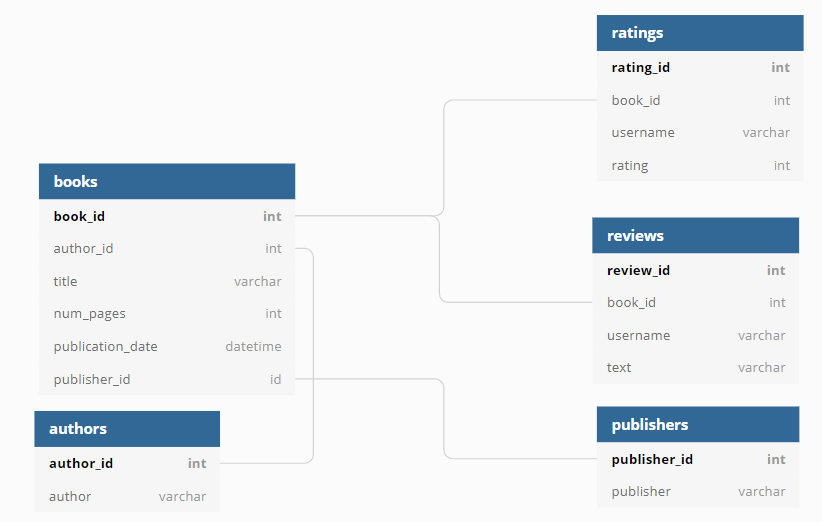

## Анализ базы данных запросами SQL
Анализ базы данных крупного сервиса для чтения книг по подписке с целью создания нового продукта.

Задание: 
- подключиться к базе данных
- изучить таблицы и вывести их содержимое в тетрадке
- сделать по одному SQL-запросу для решения каждого задания

